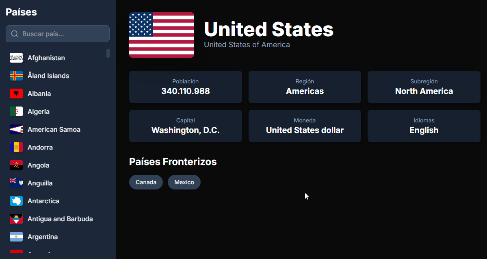

# Explorador de Países (Countries API) 🚀



> Una aplicación web interactiva que consume la [API de REST Countries](https://restcountries.com/) para mostrar información detallada sobre países de todo el mundo. El proyecto permite a los usuarios buscar, filtrar y explorar naciones en una interfaz limpia y responsiva.

**Ver el proyecto en vivo:** [**https://countries-api-dave.vercel.app/**](https://countries-api-dave.vercel.app/)

---

## ✨ Características Principales

* **🌍 Exploración Global:** Muestra todos los países al cargar la página.
* **🔍 Búsqueda en Tiempo Real:** Filtra países por nombre de forma instantánea mientras el usuario escribe.
* **📄 Página de Detalles:** Al hacer clic en un país, se muestra una vista detallada con información clave como capital, población, moneda, lenguajes y países vecinos.
* **📱 Diseño Totalmente Responsivo:** Interfaz adaptable a dispositivos móviles, tablets y escritorio.

---

## 🛠️ Stack Tecnológico


---

## 🚀 Instalación y Uso Local

Para clonar y correr este proyecto en tu máquina local, sigue estos pasos:

1.  **Clona el repositorio:**
    ```bash
    git clone [https://github.com/TechDaveDev/countries-api.git](https://github.com/TechDaveDev/countries-api.git)
    cd countries-api
    ```

2.  **Instala las dependencias:**
    ```bash
    npm install
    ```

3.  **Inicia el servidor de desarrollo:**
    ```bash
    npm run dev
    ```

Abre [http://localhost:3000](http://localhost:3000) en tu navegador para ver la aplicación.